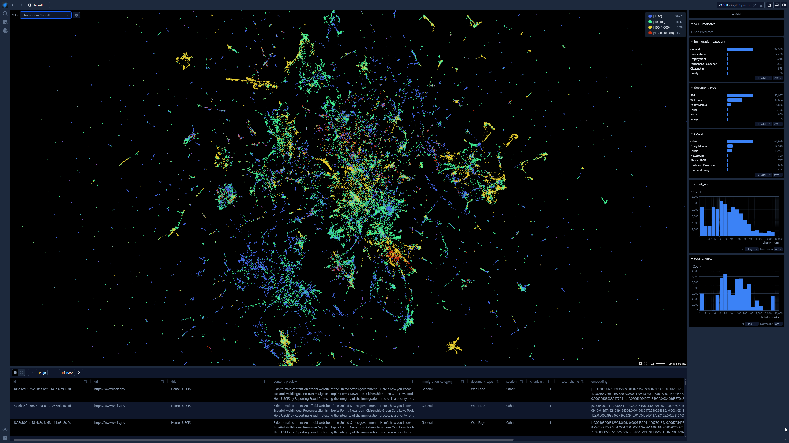
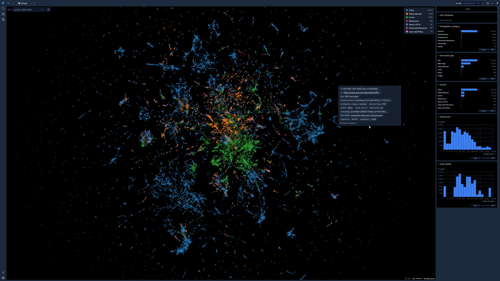
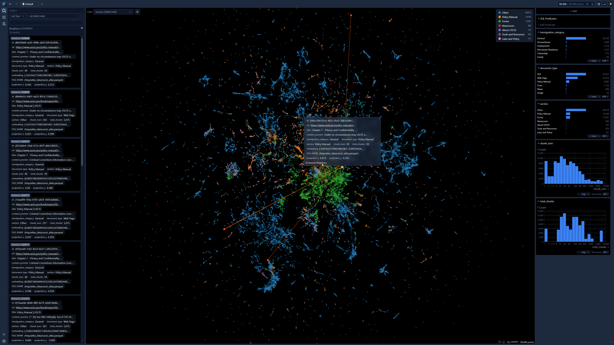
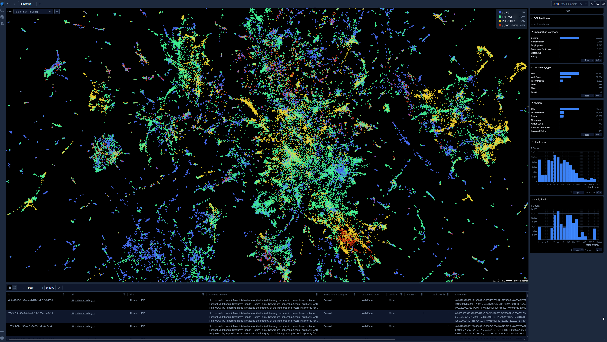

<p align="center">
  
</p>

# 🇺🇸 USCIS Knowledge Base

A comprehensive knowledge base of **99,489 content chunks** from **4,666 USCIS pages** with **OpenAI embeddings** (1536-dim), ready for RAG (Retrieval-Augmented Generation), semantic search, and GraphRAG applications.

[](reports/DATA_AUDIT.md)
[]()
[]()
[]()
[](https://huggingface.co/datasets/0xrphl/USCIS-knowledge-base-full-website)
[](https://github.com/firecrawl/firecrawl)
[](https://github.com/apple/embedding-atlas)

---

## 📋 Overview

This dataset was built by scraping the entire [USCIS website](https://www.uscis.gov) using [Firecrawl](https://github.com/firecrawl/firecrawl), chunking the content, classifying it by immigration category, and generating OpenAI `text-embedding-ada-002` embeddings.

### Data Breakdown

| Document Type | Chunks | % |
|---|---|---|
| PDF | 55,957 | 56.2% |
| Web Page | 32,625 | 32.8% |
| Policy Manual | 8,886 | 8.9% |
| Form | 1,156 | 1.2% |
| News | 800 | 0.8% |
| Image | 65 | 0.1% |

| Immigration Category | Chunks | % |
|---|---|---|
| General | 92,520 | 93.0% |
| Humanitarian | 2,488 | 2.5% |
| Employment | 2,219 | 2.2% |
| Permanent Residence | 1,553 | 1.6% |
| Citizenship | 573 | 0.6% |
| Family | 136 | 0.1% |

---

## 🔬 Embedding Atlas — Interactive Visualization

[Apple's Embedding Atlas](https://github.com/apple/embedding-atlas) runs UMAP dimension reduction on the 99K embeddings and provides interactive cluster exploration:

<p align="center">
  
</p>

<p align="center">
  
</p>

<details>
<summary>🔍 More Atlas Screenshots</summary>

**Nearest Neighbors Search:**
<p align="center">
  
</p>

**Zoomed-in Cluster Detail:**
<p align="center">
  
</p>

</details>

---

## 📦 Get the Dataset

The full dataset (content + embeddings) is hosted on 🤗 HuggingFace:

📦 **[huggingface.co/datasets/0xrphl/USCIS-knowledge-base-full-website](https://huggingface.co/datasets/0xrphl/USCIS-knowledge-base-full-website)**

### Load with 🤗 Datasets

```python
from datasets import load_dataset

# Load content chunks (99,489 rows)
content = load_dataset("0xrphl/USCIS-knowledge-base-full-website", "content", split="train")
print(content[0])

# Load embeddings (99,488 rows × 1536-dim float32 vectors)
embeddings = load_dataset("0xrphl/USCIS-knowledge-base-full-website", "embeddings", split="train")
print(len(embeddings[0]["embedding"]))  # 1536
```

### Load with Pandas

```python
import pandas as pd

content = pd.read_parquet("hf://datasets/0xrphl/USCIS-knowledge-base-full-website/data/uscis_content.parquet")
embeddings = pd.read_parquet("hf://datasets/0xrphl/USCIS-knowledge-base-full-website/data/uscis_embeddings.parquet")
```

---

## 🏗️ Architecture

```
 🤗 HuggingFace ──▶ data-loader ──▶ PostgreSQL + pgvector
                                         │
                          ┌──────────────┼──────────────┐
                          ▼              ▼              ▼
                       Milvus         Neo4j      Embedding Atlas
                      (Vectors)     (GraphRAG)    (Apple - UMAP)
```

| Service | Port | Web UI | Credentials |
|---|---|---|---|
| **PostgreSQL** | `5432` | — | `postgres` / `postgres` |
| **pgAdmin** | `5050` | [localhost:5050](http://127.0.0.1:5050) | `admin@admin.com` / `admin` |
| **Embedding Atlas** | `8080` | [localhost:8080](http://localhost:8080) | — |
| **Milvus** | `19530` | — | — |
| **Attu** (Milvus UI) | `3000` | [localhost:3000](http://localhost:3000) | — |
| **Neo4j** | `7474` / `7687` | [localhost:7474](http://localhost:7474) | `neo4j` / `neo4jpassword` |
| **MinIO** | `9001` | [localhost:9001](http://localhost:9001) | `minioadmin` / `minioadmin` |

---

## 🚀 Quick Start

### 1. Start Everything (One Command)

```bash
git clone https://github.com/0xrphl/USCIS-knowledge-base-full-website.git
cd USCIS-knowledge-base-full-website

cp .env.example .env
docker compose up -d
```

This will automatically:
1. Start PostgreSQL + pgvector
2. Download dataset from 🤗 HuggingFace (99K chunks + embeddings)
3. Load data into PostgreSQL
4. Launch [Embedding Atlas](https://github.com/apple/embedding-atlas) with UMAP visualization
5. Start Milvus, Neo4j, pgAdmin

### 2. Explore the Embeddings

Open **[localhost:8080](http://localhost:8080)** — [Apple's Embedding Atlas](https://github.com/apple/embedding-atlas) provides:
- 🏷️ **Automatic clustering & labeling** of 99K USCIS content chunks
- 🫧 **UMAP dimension reduction** (1536D → 2D) with density contours
- 🔍 **Real-time search & nearest neighbors**
- 📊 **Cross-filtering** by immigration category, document type, section

### 3. Browse the Data

- **Embedding Atlas**: http://localhost:8080 — Interactive embedding visualization
- **pgAdmin**: http://127.0.0.1:5050 — SQL queries
- **Neo4j Browser**: http://localhost:7474 — Knowledge graph
- **Attu (Milvus)**: http://localhost:3000 — Vector search

### 4. Ingest Data into Milvus & Neo4j (Optional)

```bash
pip install -r scripts/requirements.txt
python scripts/ingest.py --milvus --graph
```

---

## 🔧 Ingestion Pipeline

The `scripts/ingest.py` script is the full scraping and ingestion pipeline built with [Firecrawl](https://github.com/firecrawl/firecrawl). It supports 7 stages:

| Stage | Command | Description |
|---|---|---|
| 1. Discover | `--discover` | Find URLs via [Firecrawl](https://github.com/firecrawl/firecrawl) map + SEO sitemaps |
| 2. Scrape | `--scrape` | Crawl pages with [Firecrawl](https://github.com/firecrawl/firecrawl) (markdown + HTML) |
| 3+4. Classify & Chunk | `--chunk` | Categorize content + split into ~1,500 char chunks |
| 5. Embed | `--embed` | Generate OpenAI text-embedding-ada-002 vectors |
| 6. Milvus | `--milvus` | Ingest vectors into Milvus for similarity search |
| 7. Graph | `--graph` | Build Neo4j knowledge graph for GraphRAG |

### Tools Used
- **[Firecrawl](https://github.com/firecrawl/firecrawl)** — Web scraping and URL discovery
- **[Embedding Atlas](https://github.com/apple/embedding-atlas)** — Interactive embedding visualization (Apple)
- **OpenAI `text-embedding-ada-002`** — 1536-dimensional embeddings
- **PostgreSQL + pgvector** — Primary storage
- **Milvus** — Vector similarity search
- **Neo4j** — Knowledge graph for GraphRAG

---

## 📁 Project Structure

```
.
├── docker-compose.yml              # Full stack: PG + Atlas + Milvus + Neo4j
├── Dockerfile                      # Python container for scripts
├── .env.example                    # Environment template
├── README.md
│
├── images/                         # Screenshots and assets
│   ├── uscis-knowledge-base-banner.svg
│   ├── atlas-clusters.png
│   ├── atlas-overview.png
│   ├── atlas-neighbours.png
│   └── atlas-zoom.png
│
├── scripts/                        # Python pipeline
│   ├── config.py                   # Environment config loader
│   ├── requirements.txt            # Python dependencies
│   ├── load_from_huggingface.py    # Auto-download HF data → PostgreSQL
│   ├── run_atlas.py                # Embedding Atlas visualization
│   └── ingest.py                   # Full Firecrawl scraping pipeline
│
└── reports/                        # Data documentation
    ├── DATA_AUDIT.md
    ├── INGESTION_ERRORS.md
    └── SCHEMA.md
```

---

## 📊 Data Quality

See [reports/DATA_AUDIT.md](reports/DATA_AUDIT.md) for the full report.

| Check | Status | Score |
|---|---|---|
| All URLs have content | ✅ Pass | 100% |
| All content has embeddings | ⚠️ 1 missing | 99.999% |
| No null required fields | ✅ Pass | 100% |
| Chunk sequence integrity | ⚠️ 1 URL with gaps | 99.98% |
| **Overall** | **✅ Excellent** | **99.99%** |

---

## 🗺️ Roadmap

- [x] Scrape 4,666 USCIS pages with [Firecrawl](https://github.com/firecrawl/firecrawl)
- [x] Chunk content (~1,500 chars, 99,489 chunks)
- [x] Generate OpenAI embeddings (99,488/99,489)
- [x] Upload dataset to [HuggingFace](https://huggingface.co/datasets/0xrphl/USCIS-knowledge-base-full-website)
- [x] Data audit and quality reports
- [x] Firecrawl ingestion pipeline
- [x] Auto-load from HuggingFace on `docker compose up`
- [x] [Embedding Atlas](https://github.com/apple/embedding-atlas) UMAP visualization
- [x] UMAP cluster analysis (1536D → 2D)
- [ ] Milvus vector ingestion from HuggingFace
- [ ] Neo4j GraphRAG knowledge graph
- [ ] Semantic search API
- [ ] RAG chatbot demo

---

## 📄 License

Data sourced from [USCIS.gov](https://www.uscis.gov) (U.S. government public domain).  
Scraped with [Firecrawl](https://github.com/firecrawl/firecrawl).  
Visualized with [Embedding Atlas](https://github.com/apple/embedding-atlas) (Apple, MIT).  
Code is MIT licensed.
