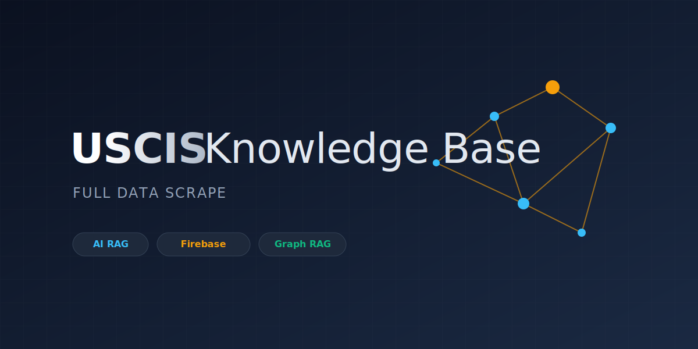

<p align="center">
  
</p>

# 🇺🇸 USCIS Knowledge Base

A comprehensive knowledge base of **99,489 content chunks** from **4,666 USCIS pages** with **OpenAI embeddings** (1536-dim), ready for RAG (Retrieval-Augmented Generation), semantic search, and GraphRAG applications.

[](reports/DATA_AUDIT.md)
[]()
[]()
[]()
[](https://huggingface.co/datasets/0xrphl/USCIS-knowledge-base-full-website)
[](https://github.com/firecrawl/firecrawl)

---

## 📋 Overview

This dataset was built by scraping the entire [USCIS website](https://www.uscis.gov) using [Firecrawl](https://github.com/firecrawl/firecrawl), chunking the content, classifying it by immigration category, and generating OpenAI `text-embedding-ada-002` embeddings.

### Data Breakdown

| Document Type | Chunks | % |
|---|---|---|
| PDF | 55,957 | 56.2% |
| Web Page | 32,625 | 32.8% |
| Policy Manual | 8,886 | 8.9% |
| Form | 1,156 | 1.2% |
| News | 800 | 0.8% |
| Image | 65 | 0.1% |

| Immigration Category | Chunks | % |
|---|---|---|
| General | 92,520 | 93.0% |
| Humanitarian | 2,488 | 2.5% |
| Employment | 2,219 | 2.2% |
| Permanent Residence | 1,553 | 1.6% |
| Citizenship | 573 | 0.6% |
| Family | 136 | 0.1% |

---

## 🏗️ Architecture

```
┌─────────────┐     ┌──────────────┐     ┌─────────────┐
│  Firecrawl   │────▶│  PostgreSQL   │────▶│   Milvus    │
│  (Scraping)  │     │  + pgvector   │     │  (Vectors)  │
└─────────────┘     └──────┬───────┘     └─────────────┘
                           │
                     ┌─────▼───────┐
                     │   Neo4j     │
                     │  (GraphRAG) │
                     └─────────────┘
```

| Service | Port | Web UI | Credentials |
|---|---|---|---|
| **PostgreSQL** | `5432` | — | `postgres` / `postgres` |
| **pgAdmin** | `5050` | [localhost:5050](http://127.0.0.1:5050) | `admin@admin.com` / `admin` |
| **Milvus** | `19530` | — | — |
| **Attu** (Milvus UI) | `3000` | [localhost:3000](http://localhost:3000) | — |
| **Neo4j** | `7474` / `7687` | [localhost:7474](http://localhost:7474) | `neo4j` / `neo4jpassword` |
| **MinIO** | `9001` | [localhost:9001](http://localhost:9001) | `minioadmin` / `minioadmin` |

---

## 🚀 Quick Start

### 1. Start Infrastructure

```bash
# Clone the repo
git clone https://github.com/0xrphl/USCIS-knowledge-base-full-website.git && cd USCIS-knowledge-base-full-website

# Copy environment config
cp .env.example .env

# Start all services (first run restores the DB backup — takes ~5 min)
docker compose up -d

# Watch the restore progress
docker logs -f supabase_db
```

Wait until you see `=== Restore complete ===`, then all services are ready.

### 2. Browse the Data

- **pgAdmin**: http://127.0.0.1:5050 → Expand "Supabase Local" → Schemas → public → Tables
- **Neo4j Browser**: http://localhost:7474 (after running the graph ingestion)
- **Attu (Milvus)**: http://localhost:3000 (after running Milvus ingestion)

### 3. Ingest into Milvus & Neo4j

```bash
# Install Python dependencies
pip install -r scripts/requirements.txt

# Edit .env with your API keys (OpenAI, Firecrawl)
# Then ingest from the existing DB snapshot:
python scripts/ingest.py --milvus --graph
```

### 4. Load from HuggingFace (Alternative)

Don't want to restore the backup? Load the data directly from 🤗 HuggingFace:

```python
from datasets import load_dataset

# Load content chunks
content = load_dataset("0xrphl/USCIS-knowledge-base-full-website", "content", split="train")

# Load embeddings (1536-dim OpenAI vectors)
embeddings = load_dataset("0xrphl/USCIS-knowledge-base-full-website", "embeddings", split="train")
```

📦 **Dataset:** [huggingface.co/datasets/0xrphl/USCIS-knowledge-base-full-website](https://huggingface.co/datasets/0xrphl/USCIS-knowledge-base-full-website)

### 5. Export CSVs / Parquet

```bash
python scripts/export_csv.py --output-dir exports/
python scripts/export_parquet.py --output-dir huggingface/data/
```

---

## 📁 Project Structure

```
.
├── docker-compose.yml                          # PG + pgAdmin + Milvus + Neo4j
├── .env.example                                # Environment template
├── .gitignore
├── README.md
├── db_cluster-26-07-2025@08-08-01.backup       # Supabase pg_dumpall (~3 GB)
├── pgadmin-servers.json                        # Pre-configured pgAdmin server
│
├── init/                                       # DB initialization
│   ├── 01-extensions.sql                       # pgvector, uuid-ossp, pgcrypto
│   └── 02-restore.sh                          # Auto-restore on first startup
│
├── scripts/                                    # Python pipeline
│   ├── config.py                               # Environment config loader
│   ├── requirements.txt                        # Python dependencies
│   ├── export_csv.py                           # Export tables to CSV
│   └── ingest.py                               # Full ingestion pipeline (v2)
│
└── reports/                                    # Data documentation
    ├── DATA_AUDIT.md                           # Full data quality report
    ├── INGESTION_ERRORS.md                     # Error analysis
    └── SCHEMA.md                               # Database schema docs
```

---

## 🔧 Ingestion Pipeline (v2)

The `scripts/ingest.py` script is a **reverse-engineered** recreation of the original pipeline. It supports 7 stages:

| Stage | Command | Description |
|---|---|---|
| 1. Discover | `--discover` | Find URLs via Firecrawl map + SEO sitemaps |
| 2. Scrape | `--scrape` | Crawl pages with Firecrawl (markdown + HTML) |
| 3+4. Classify & Chunk | `--chunk` | Categorize content + split into ~1,500 char chunks |
| 5. Embed | `--embed` | Generate OpenAI text-embedding-ada-002 vectors |
| 6. Milvus | `--milvus` | Ingest vectors into Milvus for similarity search |
| 7. Graph | `--graph` | Build Neo4j knowledge graph for GraphRAG |

```bash
# Full pipeline (fresh scrape — requires API keys)
python scripts/ingest.py --all

# Re-ingest from existing snapshot (no API keys needed for Milvus/Neo4j)
python scripts/ingest.py --milvus --graph

# Generate missing embeddings only
python scripts/ingest.py --embed
```

### Original Tools Used
- **[Firecrawl](https://github.com/firecrawl/firecrawl)** — Web scraping and URL discovery
- **OpenAI `text-embedding-ada-002`** — 1536-dimensional embeddings
- **Supabase (PostgreSQL + pgvector)** — Primary storage
- **SEO sitemap parsing** — URL seed discovery

---

## 📊 Data Quality

See [reports/DATA_AUDIT.md](reports/DATA_AUDIT.md) for the full report.

| Check | Status | Score |
|---|---|---|
| All URLs have content | ✅ Pass | 100% |
| All content has embeddings | ⚠️ 1 missing | 99.999% |
| No null required fields | ✅ Pass | 100% |
| Chunk sequence integrity | ⚠️ 1 URL with gaps | 99.98% |
| **Overall** | **✅ Excellent** | **99.99%** |

---

## 🗺️ Roadmap

- [x] Scrape 4,666 USCIS pages with Firecrawl
- [x] Chunk content (~1,500 chars, 99,489 chunks)
- [x] Generate OpenAI embeddings (99,488/99,489)
- [x] Store in PostgreSQL + pgvector
- [x] Docker Compose setup with auto-restore
- [x] Data audit and quality reports
- [x] CSV export script
- [x] Reverse-engineer ingestion pipeline (v2)
- [ ] Milvus vector ingestion
- [ ] Neo4j GraphRAG knowledge graph
- [ ] HuggingFace dataset upload
- [ ] Semantic search API
- [ ] RAG chatbot demo
- [ ] Incremental re-scraping (delta updates)
- [ ] Multi-language support (Spanish translations)

---

## 📋 Credentials Summary

| Service | User/Email | Password | URL |
|---|---|---|---|
| **PostgreSQL** | `postgres` | `postgres` | `localhost:5432` |
| **pgAdmin** | `admin@admin.com` | `admin` | http://127.0.0.1:5050 |
| **Neo4j** | `neo4j` | `neo4jpassword` | http://localhost:7474 |
| **MinIO** | `minioadmin` | `minioadmin` | http://localhost:9001 |
| **Milvus/Attu** | — | — | http://localhost:3000 |

---

## 📄 License

Data sourced from [USCIS.gov](https://www.uscis.gov) (U.S. government public domain).  
Code is MIT licensed.
